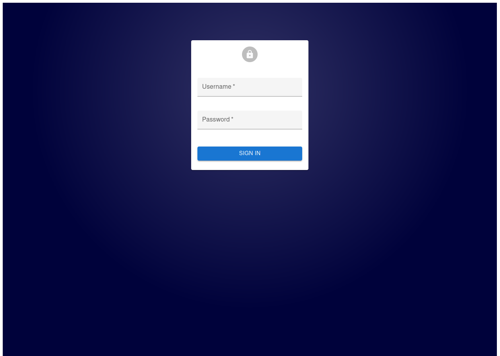
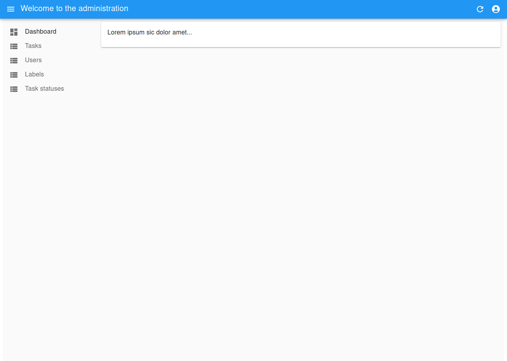
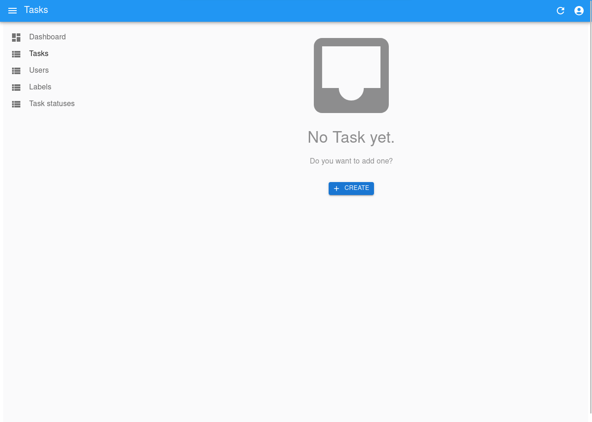
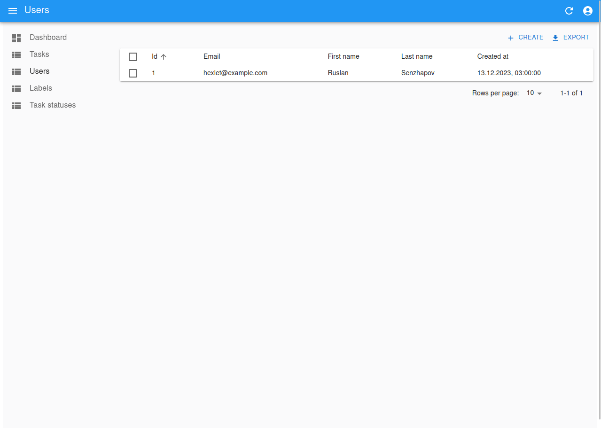
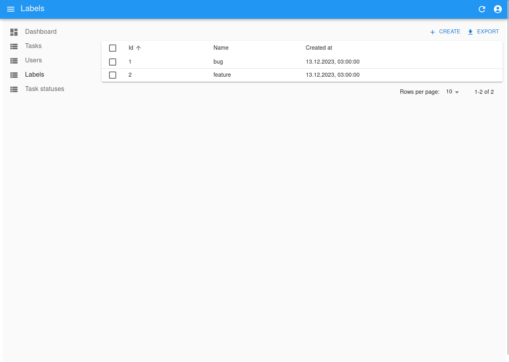
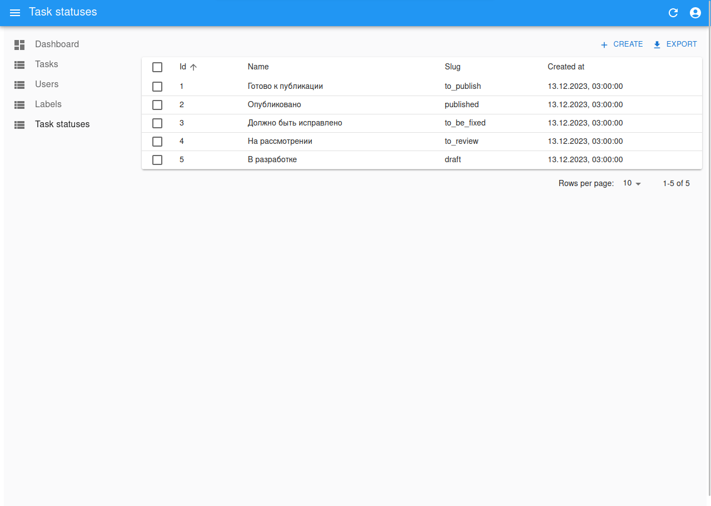

## Task Manager

Task Manager is a task management system. It allows you to set tasks, assign performers and change their statuses. To work with the system, registration and authentication are required.

This is an educational project based on the Spring Framework.

## Project is available online

Task Manager: https://task-manager-2i7v.onrender.com

login: `hexlet@example.com`
password: `qwerty`

